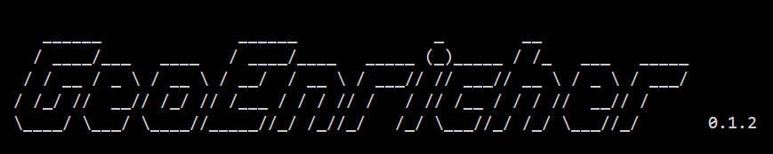
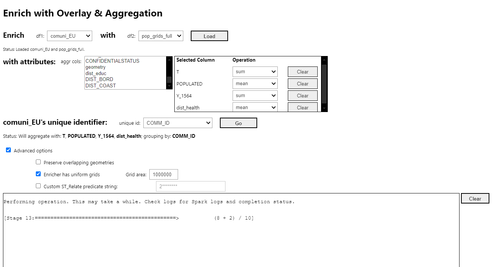
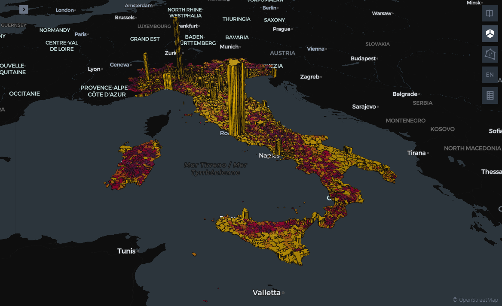

# GeoEnricher 



Geospatial processing pipeline for large-scale datasets. Built on PySpark + Sedona.

*Suitable for spatial big data analyses, service accessibility modeling, and grid-based enrichment.*

## Prerequisites

1. Python >=3.12
2. Java
3. Environment Variables Setup: JAVA_HOME, HADOOP_HOME (for windows)

    - Download Java and install it if not already done.
        - Set JAVA_HOME its respective installation directory that has directories like "bin, lib, legal..."
        - Usually it is something like `C:\Program Files\Java\jre-1.8` on windows.
        - And set system PATH = `%JAVA_HOME%\bin`.

    - Download `winutils.exe` and `hadoop.dll` from .
        - Place `winutils.exe` in a directory such as `C:/Hadoop/bin`.
        - Place `hadoop.dll` in `C:/Windows/System32`.
        - And set HADOOP_HOME = `C:/Hadoop/bin` and system PATH = `%HADOOP_HOME%\bin`.


## Setup

### Optionally, create a Python virtual environment (recommended):

- For Linux/macOS:
```bash
python -m venv .venv && \
source .venv/bin/activate && \
python -m pip install --upgrade pip
```
- For Windows:
```powershell
python -m venv .venv
.\.venv\Scripts\activate
python -m pip install --upgrade pip
```

### Installation
Make sure you have at least 1.3 GB of disk space; run:
```bash 
pip install geoenricher
```

### Getting Started
Run in the terminal:
```bash
geoenricher
```

This sets up the data directory and creates a sample notebook with necessary imports and usage guide.

---
## First Run

- This will take a while since it reads the datasets from disk, cleans and makes some essential transformations on the loaded datasets.
- But it is a one-time operation. `parquet_all()` will save all datasets to the disk; 
preserving any transformations applied.
- From next runs, you can directly load them with: `load_from_parquets()`.

### Data Directory Structure
```
data/
├── uploaded_dir_1/
├── uploaded_dir_2/
├── ...
├── pickle_parquets/
│   ├── archive/
│   ├── dfs_list/
│   └── others
├── z_maps
```

Upload your datasets in separate directories per dataset under "data/".
Other directories will be maintained automatically.

```python
from geoenricher import Enricher

# provide the data directory

data_dir = "./data"

# `datasets` in this format: 
# datasets = {"<dataset_name>": ("<path>", "<file_format>"), ...}
datasets = {
    "dg_urban": (f"{data_dir}/DGURBA", "shapefile"),
    "pop_grids": (f"{data_dir}/grids_2021_3035", "geoparquet"),
    "hospitals": (f"{data_dir}/hospitals_3035", "geopackage"),
    # ...
}

obj = Enricher(crs="EPSG:3035")
obj.setup_cluster(
    data_dir=data_dir,
    which="sedona",  # or "wherobots"
    ex_mem=26,  # Executor memory (GB)
    dr_mem=24,  # Driver memory (GB)
    log_level="ERROR"
)

obj.load(datasets, silent=True)

# optionally, run "fix_geometries()" 
# to fix invalid geometries, if any; 
# If you want to skip the check for some dataframes, 
# pass their names in "skip[]"
obj.fix_geometries(
    skip=['pop_grids', 'pop_grids_new']
)

# save dataframes in memory to disk 
# for quick access in subsequent runs
obj.parquet_all()  # default directory: "./{data_dir}/pickle_parquets/dfs_list"
# you may change the directory by passing it in `parquet_dir`,
# relative to the `data_dir`
```

### Subsequent Runs (Fast Load)
```python
obj = Enricher(crs="EPSG:3035")
obj.setup_cluster(
    data_dir=data_dir, 
    which="sedona", 
    ex_mem=26,
    dr_mem=24,
    log_level="INFO"
)

# loads all the datasets in the default directory:
# "./{data_dir}/pickle_parquets/dfs_list"
# optionally, to load from a different directory,
# pass the directory path in "parquet_dir"; reative to the {data_dir}
obj.load_from_parquets()
```

## Key Features

### Enrichment Operations

#### Enrich by Overlay + Aggregation: suitable for uniform enricher geometries like grids.



#### Enrich by Spatial Join

```python
from pyspark.sql import functions as F

# Spatial join example
enriched_df = obj.enrich_sjoin(
    df1="pop_grids",
    df2="countries",
    enr_cols=["CNTR_NAME"]
).filter(F.col('CNTR_ID') == "IT")
```

### Visualization



#### Interactive maps: 
- [Communes with hospital beds](.media_assets/maps/municipalities_beds_ratio_DGURBAN.html)
- [Communes with average drive time to the nearest hospital](.media_assets/maps/comuni_dist_hospitals_beds.html)

Pass a list of either: names of the loaded datasets or directly the Spark dataframes in memory.

```python
obj.plot_this(
    df=[ #: str | SparkDataFrame | list[str | SparkDataFrame]
        obj.dfs_list[''].filter(F.col('CNTR_ID') == 'IT'),
        # obj.dfs_list["dg_urban"].filter(F.col('CNTR_CODE') == 'IT'),
        # temp.filter(F.col('CNTR_ID') == 'IT'),
        ],  
    new_map=True,  # if False, the dataset will be added to the old map (if it exists, or else, makes a new one)
    save_html=False, # saves the Kepler map to a html file in `{data_dir}/z_maps`
    )

# you can plot the map in another cell, by running `<obj>.map`

```


## Troubleshooting

- **Invalid geometries**: run `obj.fix_geometries()` and `obj.force_repartition()` to override default partitions to the number of cores available.
- **Memory issues**: Increase `ex_mem` and/or `dr_mem`
- **Slow joins**: check `obj.inspect_partitions()`
